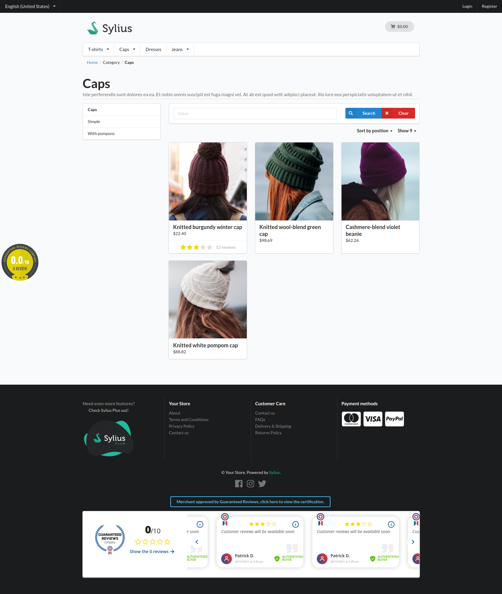
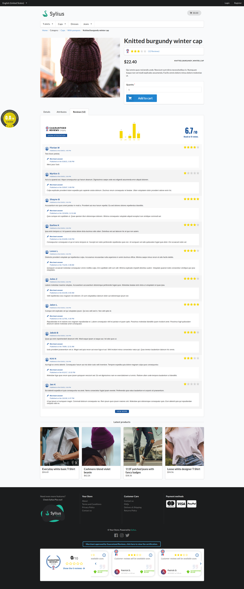
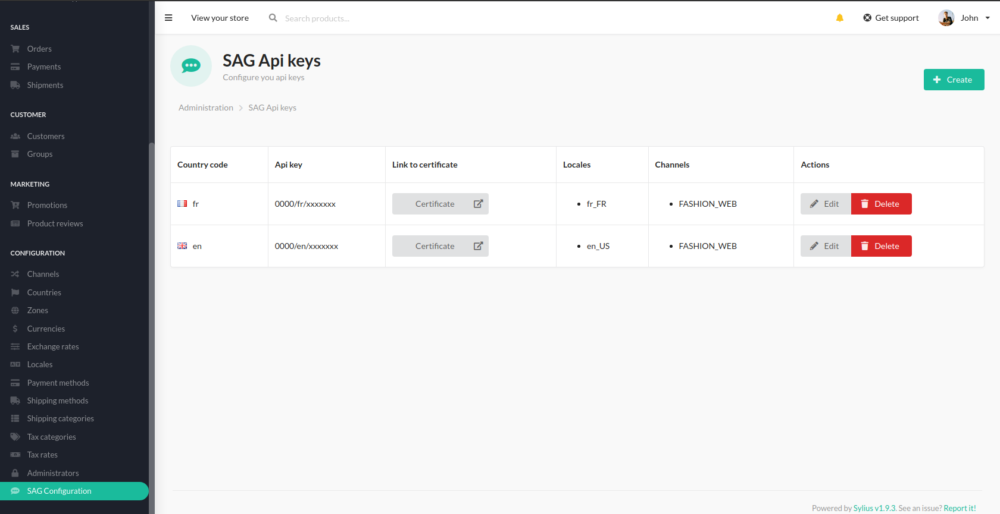
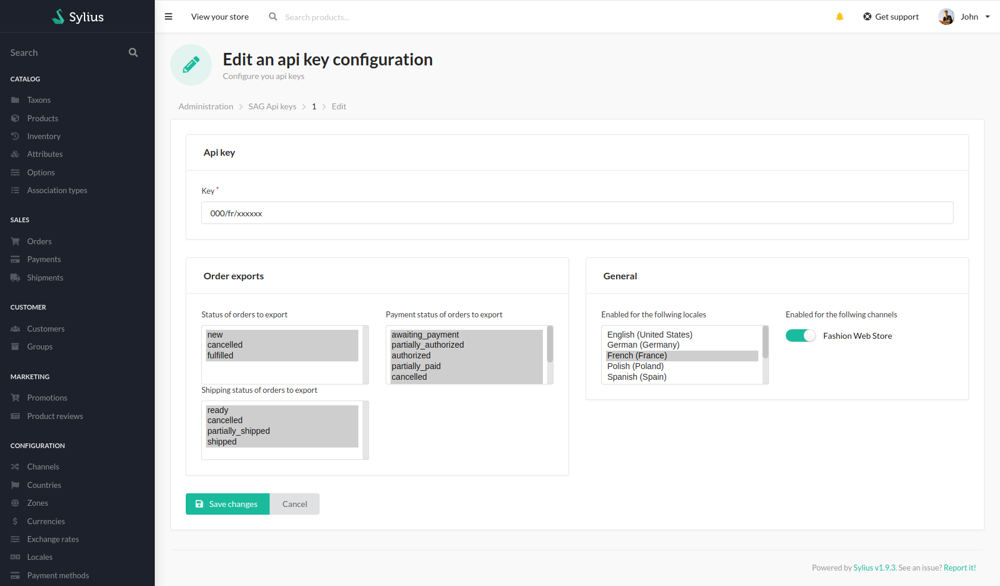
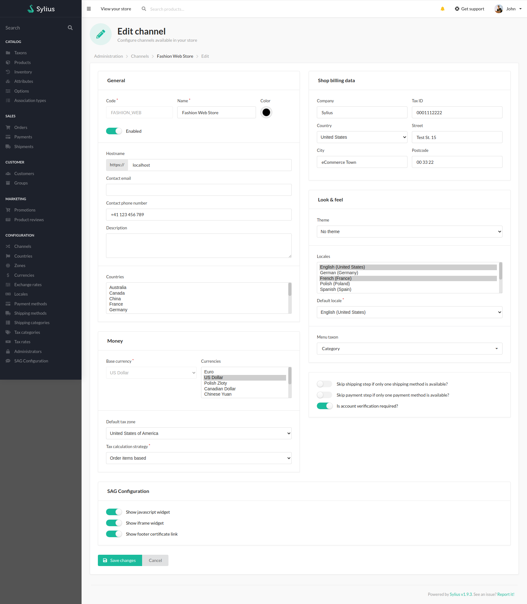
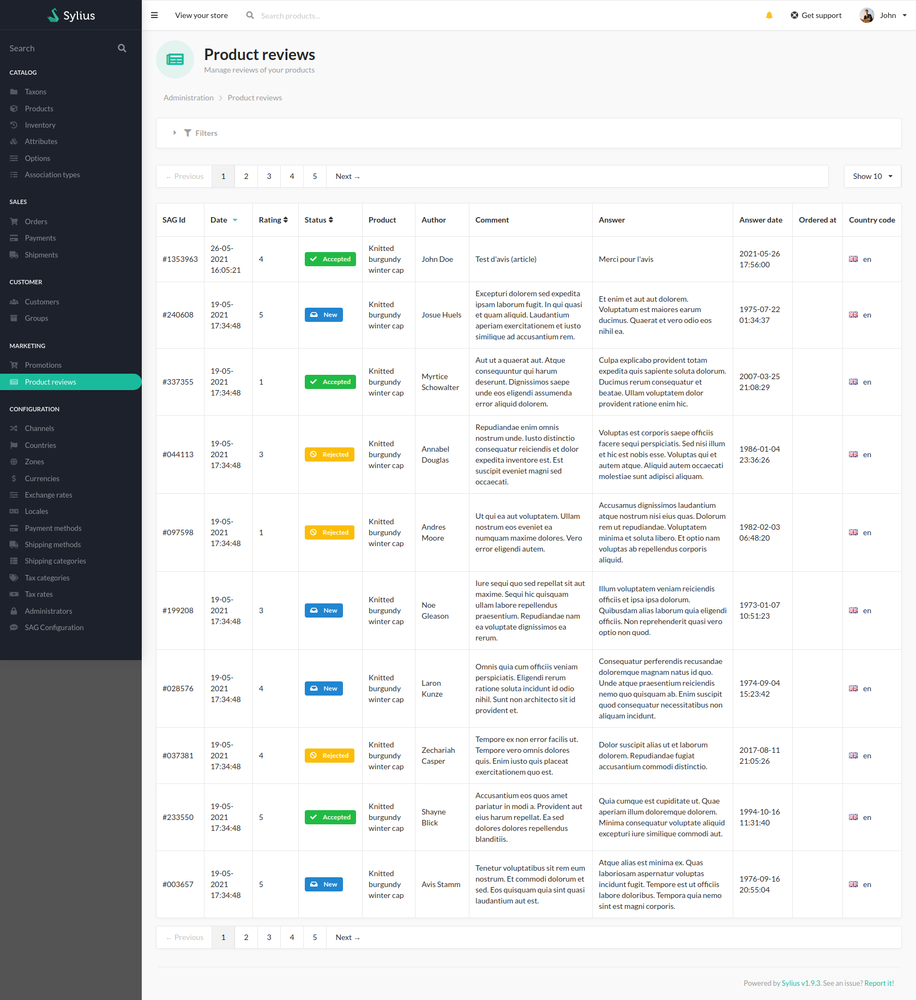

    

<h1 align="center">Plugin SAG</h1>

Sylius SAG plugin by Dedi. Product review integration for <a href="https://www.societe-des-avis-garantis.fr/">Société des Avis Garantis</a>

<h2>About Dedi</h2>

    

At Dedi, we do not just create websites. We are building together a real digital strategy to combine your business requirements with our technical skills. We've been working with open source for a long time and decided to start giving back to the community by contributing and sharing some plugin of our own.

We’ll be happy to meet you, feel free to contact us. Learn more about us on our <a href="https://www.dedi-agency.com" target="_blank">website</a>.

## Overview

### Product Index

This plugin adds the following features to your shop:
* Javascript widget
* Iframe widget
* footer certificate link

### Product Show

On your product page, you will retrieve reviews from Societé des Avis Garantis with some statistics.
 

### Admin Key Index

In the back office, a new entry "SAG Api keys" allows you to configure your shop with Société des Avis Garantis api.

### Admin Channel configuration

The channel configuration form gets a new section where you can enable or disable the following parts on your shop:
* Javascript widget
* Iframe widget
* footer certificate link

### Admin Reviews

Reviews are now not editable in the back office to comply with Société des Avis Garantis requirements.

## Documentation

- [Installation](doc/INSTALL.md)
